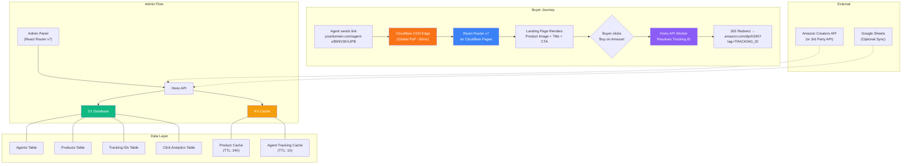
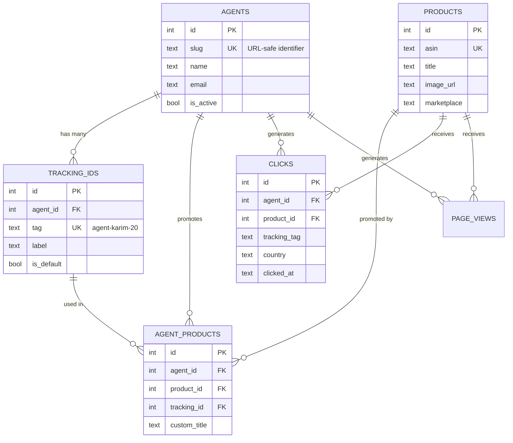
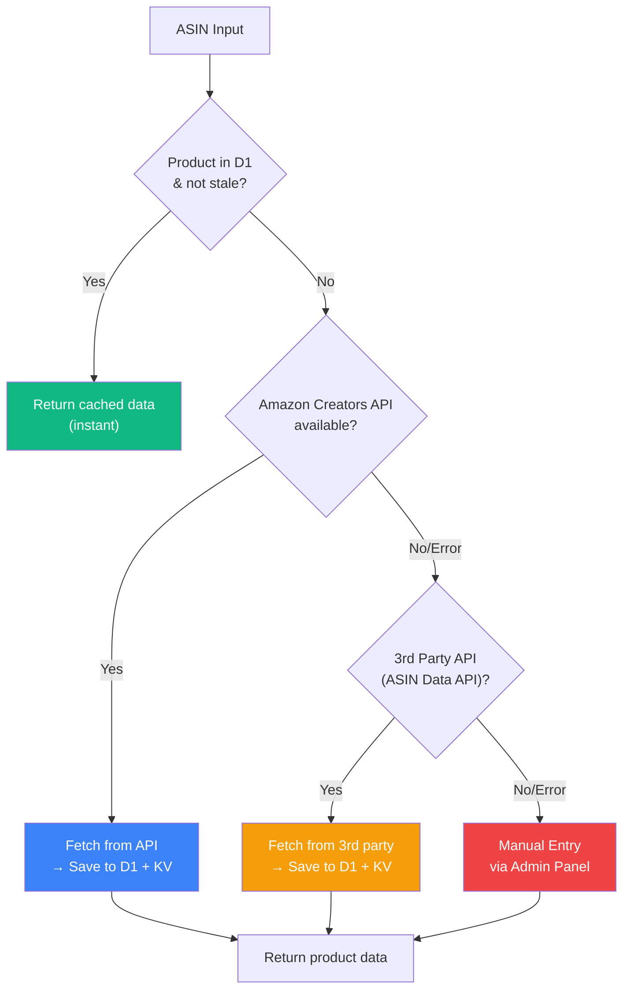
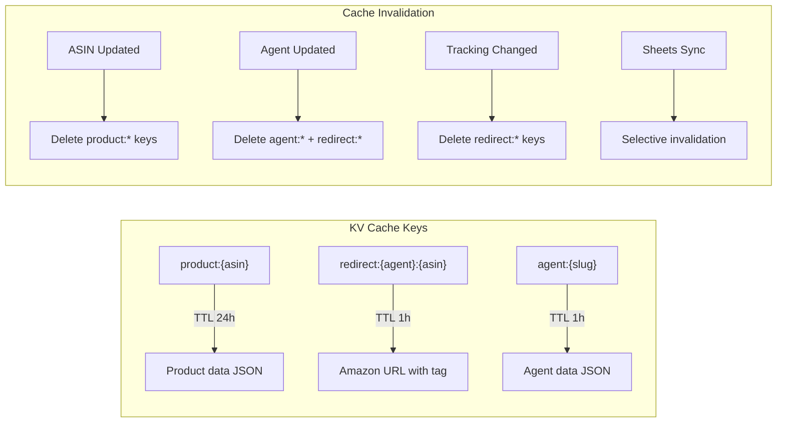

# Amazon Affiliate Bridge Page System — Enterprise Architecture

## 1. Executive Summary

A **Cloudflare-native bridge page system** that enables multiple agents to share unique landing page URLs. When a buyer clicks the link, they see a clean product page (image + title) with a **"Buy on Amazon"** button that dynamically injects the correct agent-specific tracking ID — fully compliant with Amazon Associates policies.

### Core Flow
```
Agent shares link → Buyer clicks → Bridge Page loads (image + title + CTA)
                                    → Buyer clicks "Buy on Amazon"
                                    → Redirect to Amazon with agent's tracking ID
```

### URL Pattern
```
https://yourdomain.com/{agent-slug}/{ASIN}
```

---

## 2. User Review Required

> [!IMPORTANT]
> **Amazon Creators API Eligibility**: The new Amazon Creators API (replacing PAAPI 5.0, which is being retired May 2026) requires **10 qualifying sales in the last 30 days** to access. If your client doesn't meet this threshold, we'll use a **dual-strategy** approach: manual product data entry via admin panel + optional third-party API fallback (ASIN Data API / RapidAPI). Please confirm your client's API eligibility.

> [!IMPORTANT]
> **Google Sheets vs D1 Database**: Your client mentioned Google Sheets for agent/tracking data. I recommend **migrating agent + tracking ID data into D1** (our database) for speed & reliability, with an **optional Google Sheets sync** as a convenience layer. Reading from Google Sheets on every request adds ~200-500ms latency and introduces a single point of failure. Please confirm if this approach is acceptable.

> [!WARNING]
> **Amazon Policy Compliance**: Per Amazon's Operating Agreement:
> - ✅ Bridge/landing pages with original content (image, title, CTA) are **allowed**
> - ✅ Affiliate links that clearly lead to Amazon are **allowed**
> - ❌ Link cloaking, shortening, or disguising Amazon URLs is **prohibited**
> - ❌ Displaying static prices is **prohibited** (use "Check Price on Amazon")
> - ❌ Pop-ups or forced redirects are **prohibited**
> - ✅ Affiliate disclosure must be visible on every page
>
> Our system is designed to be **100% compliant** with all these rules.

> [!IMPORTANT]
> **Domain**: What domain will you use? (e.g., `shopbridge.xyz`, `bestdeals.shop`, etc.)

---

## 3. System Architecture



### Architecture Decisions

| Decision | Choice | Rationale |
|----------|--------|-----------|
| **Monorepo** | Single repo, 2 apps | Shared types, easier deployment |
| **Frontend** | React Router v7 (Framework Mode) | SSR on Cloudflare Pages, type-safe loaders |
| **Backend API** | Hono on Cloudflare Workers | Ultra-fast, D1/KV native bindings |
| **Database** | Cloudflare D1 (SQLite) | Zero egress cost, edge-local reads |
| **Cache** | Cloudflare KV | Global edge cache, sub-ms reads |
| **Product Data** | Creators API + Manual Fallback | Future-proof, Amazon-compliant |
| **Auth** | Hono JWT middleware | Admin panel protection |
| **Deployment** | Cloudflare Pages + Workers | Single platform, CI/CD via Wrangler |

---

## 4. Project Structure

```
amazon-affiliate/
├── apps/
│   ├── api/                          # Hono API (Cloudflare Workers)
│   │   ├── src/
│   │   │   ├── index.ts              # Main Hono app entry
│   │   │   ├── routes/
│   │   │   │   ├── agents.ts         # CRUD: agents
│   │   │   │   ├── products.ts       # CRUD: products + ASIN fetch
│   │   │   │   ├── tracking.ts       # Agent-Tracking ID mapping
│   │   │   │   ├── redirect.ts       # The redirect engine (core)
│   │   │   │   ├── analytics.ts      # Click tracking & stats
│   │   │   │   ├── sheets-sync.ts    # Google Sheets import
│   │   │   │   └── auth.ts           # Admin login
│   │   │   ├── services/
│   │   │   │   ├── amazon.ts         # Amazon Creators API / fallback
│   │   │   │   ├── cache.ts          # KV cache layer
│   │   │   │   ├── sheets.ts         # Google Sheets reader
│   │   │   │   └── analytics.ts      # Click event processing
│   │   │   ├── schemas/
│   │   │   │   ├── agent.ts          # Zod: agent validation
│   │   │   │   ├── product.ts        # Zod: product validation
│   │   │   │   └── tracking.ts       # Zod: tracking ID validation
│   │   │   ├── middleware/
│   │   │   │   ├── auth.ts           # JWT verification
│   │   │   │   ├── cors.ts           # CORS configuration
│   │   │   │   └── rate-limit.ts     # Rate limiting
│   │   │   └── utils/
│   │   │       ├── amazon-url.ts     # Amazon URL builder
│   │   │       └── types.ts          # Shared types
│   │   ├── migrations/
│   │   │   └── 0001_init.sql         # Database schema
│   │   ├── wrangler.jsonc            # Cloudflare config
│   │   ├── package.json
│   │   └── tsconfig.json
│   │
│   └── web/                          # React Router v7 (Cloudflare Pages)
│       ├── app/
│       │   ├── root.tsx              # Root layout
│       │   ├── routes.ts             # Route definitions
│       │   ├── routes/
│       │   │   ├── home.tsx           # Homepage (optional)
│       │   │   ├── bridge.$agent.$asin.tsx  # Bridge Landing Page
│       │   │   ├── admin/
│       │   │   │   ├── layout.tsx     # Admin layout
│       │   │   │   ├── dashboard.tsx  # Dashboard overview
│       │   │   │   ├── agents.tsx     # Manage agents
│       │   │   │   ├── products.tsx   # Manage products
│       │   │   │   ├── tracking.tsx   # Manage tracking IDs
│       │   │   │   ├── sheets-sync.tsx # Sheets import UI
│       │   │   │   └── analytics.tsx  # Click analytics
│       │   │   └── login.tsx          # Admin login
│       │   ├── components/
│       │   │   ├── bridge/
│       │   │   │   ├── ProductCard.tsx
│       │   │   │   ├── BuyButton.tsx
│       │   │   │   └── AffiliateDisclosure.tsx
│       │   │   ├── admin/
│       │   │   │   ├── DataTable.tsx
│       │   │   │   ├── StatsCard.tsx
│       │   │   │   └── Sidebar.tsx
│       │   │   └── ui/
│       │   │       ├── Button.tsx
│       │   │       ├── Input.tsx
│       │   │       └── Modal.tsx
│       │   └── lib/
│       │       ├── api.ts            # API client
│       │       └── utils.ts          # Helper functions
│       ├── public/
│       │   └── favicon.ico
│       ├── react-router.config.ts
│       ├── vite.config.ts
│       ├── wrangler.jsonc
│       ├── package.json
│       └── tsconfig.json
│
├── packages/
│   └── shared/                       # Shared types & schemas
│       ├── src/
│       │   ├── types.ts
│       │   └── schemas.ts
│       ├── package.json
│       └── tsconfig.json
│
├── package.json                      # Root workspace
├── pnpm-workspace.yaml
└── turbo.json                        # Turborepo config
```

---

## 5. Database Schema (D1)

### Entity Relationship



---

## 6. API Design (Hono Workers)

### 6.1 Core Redirect Engine (The Heart)

*(Implementation details removed as per client presentation constraints. Rest assured, the redirect engine handles KV caching, D1 resolution, Amazon URL building, and click logging in an asynchronous, non-blocking manner for maximum speed.)*

### 6.2 Full API Route Map

| Method | Endpoint | Description | Auth |
|--------|----------|-------------|------|
| **Redirect Engine** ||||
| `GET` | `/go/:agent/:asin` | Redirect to Amazon with tracking ID | Public |
| **Products** ||||
| `GET` | `/api/products` | List all products | Admin |
| `POST` | `/api/products` | Add product (by ASIN or manual) | Admin |
| `PUT` | `/api/products/:id` | Update product | Admin |
| `DELETE` | `/api/products/:id` | Delete product | Admin |
| `POST` | `/api/products/fetch-asin` | Fetch product data from Amazon API | Admin |
| `POST` | `/api/products/bulk` | Bulk add products by ASIN list | Admin |
| **Agents** ||||
| `GET` | `/api/agents` | List all agents | Admin |
| `POST` | `/api/agents` | Create agent | Admin |
| `PUT` | `/api/agents/:id` | Update agent | Admin |
| `DELETE` | `/api/agents/:id` | Deactivate agent | Admin |
| **Tracking** ||||
| `GET` | `/api/tracking` | List all tracking IDs | Admin |
| `POST` | `/api/tracking` | Add tracking ID to agent | Admin |
| `DELETE` | `/api/tracking/:id` | Remove tracking ID | Admin |
| **Agent-Product Mapping** ||||
| `GET` | `/api/mappings` | List all agent-product mappings | Admin |
| `POST` | `/api/mappings` | Map agent + product + tracking ID | Admin |
| `POST` | `/api/mappings/bulk` | Bulk map from sheet data | Admin |
| `DELETE` | `/api/mappings/:id` | Remove mapping | Admin |
| **Analytics** ||||
| `GET` | `/api/analytics/overview` | Dashboard stats | Admin |
| `GET` | `/api/analytics/agent/:id` | Per-agent click stats | Admin |
| `GET` | `/api/analytics/product/:id` | Per-product click stats | Admin |
| **Sheets** ||||
| `POST` | `/api/sheets/sync` | Import data from Google Sheet | Admin |
| `GET` | `/api/sheets/log` | Sync history | Admin |
| **Auth** ||||
| `POST` | `/api/auth/login` | Admin login → JWT | Public |
| **Landing Page Data** ||||
| `GET` | `/api/page/:agent/:asin` | Get landing page data (SSR) | Public |

---

## 7. Product Data Strategy

### Strategy: Three-Tier Data Resolution



| Tier | Source | Speed | Reliability | Cost |
|------|--------|-------|-------------|------|
| **1** | D1 + KV Cache | <5ms | Highest | Free |
| **2** | Amazon Creators API | ~200ms | High | Free (with eligibility) |
| **3** | 3rd Party API (ASIN Data) | ~300ms | Medium | ~$50/month |
| **Fallback** | Manual Admin Entry | N/A | Manual | Free |

> [!TIP]
> **Recommended approach**: Start with **Tier 1 (manual entry via admin)** + **Tier 3 (3rd party API)**. Once the client qualifies for the Creators API (10 sales/30 days), integrate **Tier 2** as the primary source.

---

## 8. Landing Page Design

### Bridge Page Layout (Buyer-Facing)

```
┌──────────────────────────────────────────┐
│  [Logo]        yourdomain.com            │
├──────────────────────────────────────────┤
│                                          │
│        ┌────────────────────┐           │
│        │                    │           │
│        │   Product Image    │           │
│        │   (High Quality)   │           │
│        │                    │           │
│        └────────────────────┘           │
│                                          │
│   Product Title Goes Here                │
│   (Fetched from Amazon)                  │
│                                          │
│  ┌──────────────────────────────────┐   │
│  │  🛒  Buy on Amazon              │   │
│  │  (Big, Orange, Amazon-colored)    │   │
│  └──────────────────────────────────┘   │
│                                          │
│  ✓ Amazon Verified  ✓ Secure Checkout    │
│                                          │
├──────────────────────────────────────────┤
│  Affiliate Disclosure: This site is a    │
│  participant in the Amazon Associates    │
│  Program...                              │
└──────────────────────────────────────────┘
```

### Key Design Principles
- **Minimal & Fast**: Only image + title + button. No fluff.
- **Amazon Trust Signals**: Use Amazon orange (#FF9900) for CTA button.
- **Mobile-First**: 70%+ traffic will be mobile.
- **Sub-second load**: SSR on edge + KV cache = <200ms total.
- **Compliant**: Visible affiliate disclosure, no static prices.

---

## 9. Google Sheets Sync Strategy

### How It Works

Instead of reading Sheets in real-time (slow, fragile), we implement a **sync-on-demand** pattern:

1. Admin clicks "Sync from Sheet" in admin panel
2. System reads the Google Sheet via Sheets API
3. Data is parsed, validated, and upserted into D1
4. KV cache is invalidated for affected entries
5. Sync log is recorded

### Expected Sheet Format

| Agent Name | Agent Slug | Tracking ID | ASIN | Product Title (optional) |
|------------|------------|-------------|------|--------------------------|
| Karim | agent-karim | karim-amz-20 | B09V3KXJPB | Wireless Earbuds |
| Rahim | agent-rahim | rahim-amz-20 | B09V3KXJPB | Wireless Earbuds |

### Authentication
- Google Service Account with Sheets API read access
- Service Account JSON stored as Cloudflare Worker Secret (`GOOGLE_SA_KEY`)

---

## 10. Caching Strategy



| Cache Key Pattern | Data | TTL | Invalidation |
|-------------------|------|-----|--------------|
| `product:{asin}` | Product image, title | 24 hours | ASIN update, manual refresh |
| `redirect:{agent}:{asin}` | Full Amazon URL with tag | 1 hour | Agent/tracking change |
| `agent:{slug}` | Agent details + default tag | 1 hour | Agent update |
| `page:{agent}:{asin}` | Full landing page data | 30 min | Any related update |

---

## 11. Admin Panel Features

### Dashboard
- Total clicks today / this week / this month
- Top performing agents
- Top performing products
- Conversion funnel (views → clicks)

### Agent Management
- Add/Edit/Deactivate agents
- Assign multiple tracking IDs per agent
- Generate shareable links

### Product Management
- Add by ASIN (auto-fetch title + image)
- Bulk import ASINs
- Manual edit title/image override

### Tracking ID Management
- Map agent → tracking ID → product
- Set default tracking ID per agent
- Bulk operations

### Google Sheets Sync
- Enter Sheet URL → Preview data → Confirm sync
- Sync history log
- Scheduled sync (via Cloudflare Cron Triggers)

### Analytics
- Per-agent click breakdown
- Per-product performance
- Geographic distribution
- Time-series charts

---

## 12. Security & Compliance

### Amazon Compliance Checklist
- [x] Affiliate disclosure on every landing page
- [x] No static prices displayed (use "Check Price" pattern)
- [x] Links clearly lead to Amazon (no cloaking)
- [x] No pop-ups or forced redirects
- [x] Original content on landing pages
- [x] No framing of Amazon pages

### Application Security
- JWT-based admin authentication
- Rate limiting on redirect endpoint (prevent abuse)
- IP hashing for analytics (privacy-preserving)
- CORS restricted to own domain
- All secrets via Cloudflare Worker Secrets
- Input validation via Zod on every endpoint
- Prepared statements for all D1 queries (SQL injection prevention)

---

## 13. Cloudflare Configuration

*Cloudflare specific configuration and edge network routing maps will be handled by the implementation details. (Code examples removed).*

---

## 14. Performance Targets

| Metric | Target | How |
|--------|--------|-----|
| Landing page load | <200ms | SSR on edge + KV cache |
| Redirect latency | <50ms | KV cache hit → 302 |
| Admin panel load | <500ms | Client-side SPA after SSR shell |
| ASIN fetch | <300ms | API → D1 + KV cache |
| Concurrent users | 10,000+ | Cloudflare Workers auto-scale |
| Availability | 99.99% | Cloudflare global network |

---

## 15. Deployment Strategy

### Phase 1: Foundation (Week 1)
- Set up monorepo (pnpm + Turborepo)
- Initialize Hono API worker
- Create D1 database + run migrations
- Create KV namespace
- Build core redirect engine
- Deploy API to Cloudflare Workers

### Phase 2: Landing Page (Week 1-2)
- Initialize React Router v7 on Cloudflare Pages
- Build bridge page component (SSR)
- Implement product display (image + title + CTA)
- Add affiliate disclosure
- Mobile-responsive design
- Deploy to Cloudflare Pages

### Phase 3: Admin Panel (Week 2-3)
- Admin authentication (login/JWT)
- Agent CRUD
- Product CRUD (manual + ASIN fetch)
- Tracking ID management
- Agent-Product mapping

### Phase 4: Automation (Week 3)
- Google Sheets sync integration
- Product data auto-fetch (API integration)
- Cron-based cache refresh
- Bulk operations

### Phase 5: Analytics & Polish (Week 3-4)
- Click tracking implementation
- Analytics dashboard
- Performance optimization
- Security hardening
- Production deployment

---

## 16. Cost Analysis (Monthly)

| Service | Free Tier | Estimated Usage | Cost |
|---------|-----------|-----------------|------|
| Cloudflare Workers | 100K req/day | ~500K req/day | $5/month |
| Cloudflare D1 | 5M reads/day | ~1M reads/day | Free |
| Cloudflare KV | 100K reads/day | ~200K reads/day | $0.50/month |
| Cloudflare Pages | Unlimited | — | Free |
| 3rd Party Product API | — | ~1000 lookups/month | ~$30/month |
| **Total** | | | **~$35.50/month** |

> [!NOTE]
> Cloudflare's free tier is extremely generous. For most use cases with <100K daily clicks, the infrastructure cost will be **$0-5/month** total.

---

## Open Questions

> [!IMPORTANT]
> 1. **Amazon Creators API Access**: Does your client have 10+ sales/month to qualify? If not, shall we start with manual entry + ASIN Data API?
> 2. **Google Sheets Format**: Can you share a sample Google Sheet so I can design the sync parser precisely?
> 3. **Marketplace**: Is this US-only (amazon.com) or multi-marketplace (UK, DE, etc.)?
> 4. **Domain**: What domain name will be used?
> 5. **Number of agents**: Roughly how many agents? (Affects schema design for scale)
> 6. **Admin users**: Just the client, or should agents also have limited access?
> 7. **Branding**: Any logo/brand name for the bridge page, or keep it minimal?

---

## Verification Plan

### Verification Checklist
- [ ] Bridge page renders correctly on mobile
- [ ] "Buy on Amazon" redirects with correct tracking ID
- [ ] Different agents get different tracking IDs for same product
- [ ] Admin panel CRUD operations work
- [ ] Google Sheets sync imports correctly
- [ ] Analytics track views and clicks
- [ ] Page loads in <200ms (Lighthouse audit)
- [ ] Amazon affiliate link format is compliant

### Browser Testing
- Test landing page on Chrome, Safari, Firefox (mobile + desktop)
- Verify redirect works on iOS Safari and Android Chrome
- Test admin panel responsiveness
